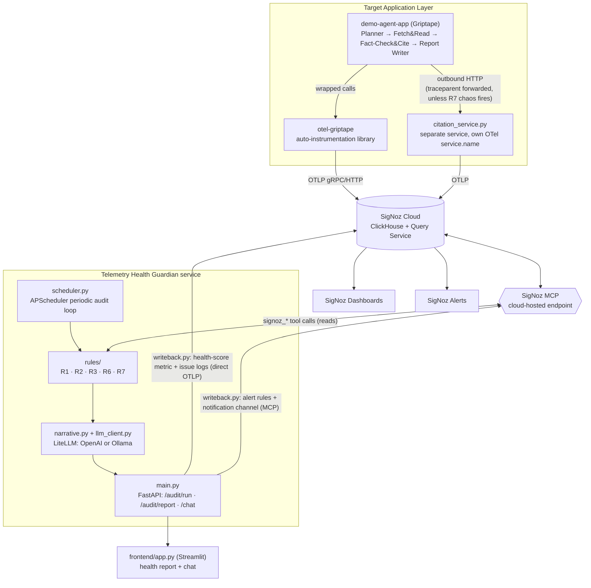

# Telemetry Health Guardian

**We don't observe the agent's behavior. We observe whether the observability
itself is trustworthy — then fix the instrumentation that produces it.**

Telemetry Health Guardian is an auditor for telemetry hygiene. It does not
watch what an AI agent *does* — it watches whether the *telemetry describing
what the agent does* can be trusted.

It has two parts:

1. **[`otel-griptape`](otel-griptape/README.md)** — an OpenTelemetry
   auto-instrumentation library for [Griptape](https://github.com/griptape-ai/griptape),
   a Python agent framework with no maintained OTel instrumentation package.
   This library emits *correct* telemetry by construction: GenAI-semconv
   spans, correct context propagation across sync and thread-pool
   concurrency, and W3C `traceparent` forwarding across outbound HTTP calls.
2. **[The Guardian service](guardian/README.md)** (`guardian/`) — an
   MCP-powered agent that continuously queries [SigNoz](https://signoz.io) —
   never the target app directly — to detect telemetry defects elsewhere:
   missing fields, cardinality explosions, broken trace trees, hidden
   truncation, and severed cross-service handoffs. It scores telemetry
   health per service, explains findings in plain, cited language, and
   writes results back into SigNoz as metrics, logs, and alerts.

Both parts run against a concrete demo workload,
[`demo-agent-app/`](demo-agent-app/README.md): a four-stage **document
research pipeline** (Planner → Fetch & Read → Fact-Check & Cite → Report
Writer) chosen because its natural failure modes line up one-to-one with
what this system detects — most notably a long PDF where only a fraction
of its content ever reaches the LLM's context, producing a confident,
wrong report with no error anywhere. That's R6's canonical case, not a
contrived one.

Each component has its own detailed README covering its modules, API, and
how to run it in isolation:
[`otel-griptape/README.md`](otel-griptape/README.md),
[`guardian/README.md`](guardian/README.md),
[`demo-agent-app/README.md`](demo-agent-app/README.md).

Rule-engine *reads* go through the **SigNoz MCP server** exclusively — never
a direct SigNoz API/SDK call that bypasses MCP (see
[Write-back mechanism](#write-back-mechanism-metrics--logs-vs-alerts) for
the one place this project's writes deliberately don't).

---

## What it catches

| ID | Check | Status |
|---|---|---|
| **R1** | Missing/incorrect GenAI semantic-convention attributes on `gen_ai.operation.name == "chat"` spans (`gen_ai.system`, `gen_ai.request.model`, `gen_ai.usage.input_tokens`, `gen_ai.usage.output_tokens`, `gen_ai.response.finish_reasons`), plus span-naming conformance (`"{operation} {model}"`) | ✅ built |
| **R2** | Cardinality risk — an attribute key flagged only when **both** `distinct_values/total_spans > 0.8` **and** average value length > 200 bytes hold, avoiding false positives on short high-cardinality fields like `trace_id` | ✅ built |
| **R3** | Orphaned span trees within a single service — a span whose `parent_span_id` is set but resolves to nothing in the same trace, cross-checked against the window edge to rule out a parent that's simply out of range | ✅ built |
| **R6** | Silent tool-payload truncation — compares `payload.raw_bytes` against `payload.captured_bytes` (custom attributes `otel-griptape` sets), flags when `captured_bytes < raw_bytes * 0.95` | ✅ built |
| **R7** | Cross-service trace breaks at agent-to-agent handoffs — an outbound call from `demo-agent-app` to `citation_service.py` that produces a new root span in the callee instead of a continuation of the caller's trace, within a 2-second handoff window | ✅ built |
| R5 | Raw-content/PII leakage heuristic | ❌ out of scope by explicit design decision — not implemented, stubbed, or scaffolded |
| ~~R4~~ | Span-naming convention (standalone) | N/A — merged into R1; there is no separate R4 module |

**Required MVP = R1 + R2 + R3 + R6**, and R7 (originally stretch/optional
scope, cleared for build once the earlier stages' gates passed) is also
fully wired end-to-end: rule engine → health-score term → LLM narrative →
SigNoz writeback → dashboard panel → alert.

---

## Architecture



**Data flow:** target app (and `citation_service.py`) emit spans →
`otel-griptape` shapes them correctly → SigNoz Cloud ingests them → Guardian
queries SigNoz *only* via the hosted MCP endpoint for reads → rule engine
(R1/R2/R3/R6/R7) + LLM produce a health report → Guardian writes the report
back to SigNoz → dashboards, alerts, and a thin chat UI surface it to a
human.

### Write-back mechanism: metrics/logs vs. alerts

These are two genuinely different mechanisms, not interchangeable:

- **Health-score metric + issue logs** (`guardian/writeback.py`'s
  `HealthWriteback`): direct OTLP export, the same mechanism
  `demo-agent-app/telemetry.py` already uses for spans. The SigNoz MCP
  server has no `signoz_write_metric` / `signoz_create_log` tool — the only
  MCP-writable resources are dashboards, alert rules, notification channels,
  and saved views, not raw telemetry — so direct OTLP is the only mechanism
  that can put a metric or log into SigNoz at all. All rule-engine *reads*
  still go through MCP exclusively.
- **Alert rules + notification channel** (`ensure_notification_channel`,
  `ensure_alerts` in the same file): real MCP tool calls
  (`signoz_create_notification_channel`, `signoz_create_alert`), same as
  every other MCP write in this project.

Emitted metrics: `telemetry.health_score`, `telemetry.missing_field_rate_pct`,
`telemetry.cardinality_risk_score`, `telemetry.orphaned_span_rate_pct`,
`telemetry.truncation_rate_pct`, `telemetry.cross_service_break_rate_pct`.

Alerts provisioned at Guardian startup (only if `GUARDIAN_ALERT_WEBHOOK_URL`
is set — otherwise this step is skipped with a log line):
- Threshold: health score < 70 for any service
- Anomaly: sudden cardinality-risk spike on any attribute key
- Threshold: truncation rate > 5% for any tool
- Threshold: cross-service break rate > 0% for any service pair — any
  occurrence flagged, since a broken handoff silently splits one trace
  into two

### Health score (per service, 0–100)

```
health_score = 100
  - (missing_field_rate_pct       * 0.30)   # R1
  - (cardinality_risk_score       * 0.25)   # R2, normalized 0-100
  - (orphaned_span_rate_pct       * 0.20)   # R3
  - (truncation_rate_pct          * 0.20)   # R6
  - (cross_service_break_rate_pct * 0.05)   # R7
```

`guardian/health_score.py` clamps the final score to `[0, 100]` but keeps
the intermediate per-rule terms unclamped for debugging. The R7 term is
only added when an `r7` result is supplied — `guardian/scheduler.py`'s
`run_audit_cycle` always fetches and passes one now that R7 is built, so
this term is present on every audit in this repo's current state.

---

## Rule engine implementation notes worth knowing

A few detection-logic decisions are documented in the rule modules
themselves and are worth surfacing here rather than leaving buried:

- **R1's naming check is literal and exact**: a `gen_ai.operation.name ==
  "chat"` span must be named exactly `"{operation} {model}"` (e.g. `"chat
  llama3.2"`). `otel-griptape`'s own instrumentor follows this by
  construction; any hand-instrumented span reporting `gen_ai.*` attributes
  (see R6 below) must match it too, or R1 will correctly flag it as a
  naming-convention violation.
- **R2's `cardinality_risk_score` normalization** (`100 * flagged_keys /
  evaluated_keys`) is this implementation's own choice — the spec defines
  the per-key flag condition but not how to roll it into one 0–100 score.
- **R3 follows the spec's literal detection text**: only a span whose
  `parent_span_id` is set but doesn't resolve within the same trace counts
  as orphaned. A span with no `parent_span_id` at all (a disconnected new
  trace root) is a different, more severe failure mode than what R3's
  Section 4.3.1 text describes — this is also why `chaos.py`'s R3 trigger
  fabricates a bogus-but-present parent span ID rather than clearing
  context outright.
- **R6's chaos mechanism routes a real Ollama call, not a fixed slice.**
  The build spec's baseline chaos design was a fixed character slice
  (`text[:700]`) applied at `fetch_and_read.py`. This repo instead routes
  one Fact-Check & Cite claim per `CHAOS_R6_RATE` roll through a real local
  Ollama model (`ollama_r6.py`) with a small `num_ctx` — Ollama's own
  context window then silently drops whatever doesn't fit, a genuine
  truncation rather than a simulated one. `fetch_and_read.py` never
  truncates; `payload.raw_bytes == payload.captured_bytes` unconditionally
  on its span. Because `griptape`'s own `OllamaPromptDriver` doesn't
  populate token usage, `ollama_r6.py` bypasses griptape entirely and calls
  Ollama's `/api/chat` directly, reading `prompt_eval_count`/`eval_count`
  for real token counts and deriving `payload.captured_bytes` from
  `prompt_eval_count` (a chars-per-token approximation, since Ollama
  doesn't report the truncated byte count directly).

---

## Repository layout

```
telemetry-health-guardian/
├── README.md
├── requirements.txt
├── env.example
│
├── otel-griptape/                     # auto-instrumentation library (standalone-installable)
│   ├── README.md                      # see this for otel-griptape's own module-by-module docs
│   ├── pyproject.toml
│   ├── otel_griptape/
│   │   ├── __init__.py
│   │   ├── instrumentor.py            # wraps Agent.run / Task dispatch / PromptDriver.run
│   │   ├── semconv.py                 # gen_ai.* attribute constants
│   │   ├── context_propagation.py     # ThreadPoolExecutor.submit patch + traceparent forwarding
│   │   └── payload_tracking.py        # payload.raw_bytes / payload.captured_bytes (R6)
│   └── tests/test_instrumentor.py
│
├── demo-agent-app/                    # document research pipeline
│   ├── README.md                      # see this for stage-by-stage docs
│   ├── app.py                         # orchestrates the 4 stages
│   ├── planner.py                     # Stage 1
│   ├── fetch_and_read.py              # Stage 2 — full-text extraction, no truncation
│   ├── fact_check_and_cite.py         # Stage 3 — concurrent claim checks; R3 site; routes to citation_service.py
│   ├── report_writer.py               # Stage 4
│   ├── citation_service.py            # separate HTTP service (own port/service name) — R7 site
│   ├── chaos.py                       # seeded fault injection: R1/R2/R3/R6/R7 triggers
│   ├── ollama_r6.py                   # R6's real-Ollama-truncation claim-check path
│   ├── telemetry.py                   # OTel bootstrap + Griptape default driver config
│   ├── requirements.txt
│   └── fixtures/generate_fixture_pdf.py   # generates the 35-page fixture used for R6
│
├── guardian/
│   ├── README.md                      # see this for module-by-module + API docs
│   ├── main.py                        # FastAPI app: /health, /audit/run, /audit/report/{service}, /chat
│   ├── scheduler.py                   # APScheduler audit loop + AuditStore cache
│   ├── mcp_client.py                  # SigNoz MCP session wrapper (cloud primary, self-host fallback)
│   ├── rules/
│   │   ├── r1_missing_fields.py
│   │   ├── r2_cardinality.py
│   │   ├── r3_orphaned_spans.py
│   │   ├── r6_silent_truncation.py
│   │   ├── r7_cross_service_breaks.py
│   │   └── types.py                   # AuditWindow
│   ├── llm_client.py                  # LiteLLM OpenAI/Ollama abstraction
│   ├── narrative.py                   # combines rule results into cited natural-language reports
│   ├── health_score.py
│   ├── writeback.py                   # metrics/logs (direct OTLP) + alerts/notification channel (MCP)
│   ├── scripts/provision_dashboards.py
│   ├── pyproject.toml
│   ├── requirements.txt
│   └── tests/                         # test_r1..r7, test_health_score, test_llm_client,
│                                       # test_narrative, test_main, test_scheduler
│
├── frontend/
│   ├── app.py                         # Streamlit: health report view + chat view
│   └── requirements.txt
│
└── experiments/                       # per-stage verification drivers + build notes
    ├── stage_wise_guidance.txt
    ├── stage7_notes.txt
    └── test_stage3.py … test_stage8.py
```

---

## Setup

```bash
cp env.example .env   # fill in SigNoz Cloud MCP creds + at least one LLM provider

pip install -r requirements.txt
pip install -e otel-griptape
pip install -e guardian[test]
pip install -r demo-agent-app/requirements.txt
pip install -r frontend/requirements.txt
```

`env.example` covers: SigNoz Cloud MCP (`SIGNOZ_INSTANCE_URL`,
`SIGNOZ_MCP_URL`, `SIGNOZ_API_KEY`, `SIGNOZ_MCP_MODE`, `SIGNOZ_CLOUD_REGION`
— see [`guardian/README.md`](guardian/README.md#configuration) for the
cloud-vs-self-hosted switch), the OTLP export target for the demo app
(`OTEL_EXPORTER_OTLP_ENDPOINT`, `OTEL_EXPORTER_OTLP_HEADERS`,
`OTEL_SERVICE_NAME`), the LLM reasoning layer (`LLM_PROVIDER`,
`OPENAI_API_KEY`, `OPENAI_MODEL`, `OLLAMA_BASE_URL`, `OLLAMA_MODEL`), the
Guardian service (`AUDIT_INTERVAL_MINUTES`, `FASTAPI_PORT`,
`AUDIT_SERVICES`, `AUDIT_WINDOW`, `GUARDIAN_ALERT_WEBHOOK_URL`), the
frontend (`GUARDIAN_API_URL`), `citation_service.py`
(`CITATION_SERVICE_URL`, `CITATION_SERVICE_PORT`,
`CITATION_SERVICE_TIMEOUT_SECONDS`), and `ollama_r6.py`'s own call timeout
(`OLLAMA_R6_TIMEOUT_SECONDS`, separate from the Guardian's own
`LLM_PROVIDER=ollama` path but pointed at the same `OLLAMA_BASE_URL`).
`guardian/scheduler.py` defaults `AUDIT_WINDOW` to `5m` if unset — the
shipped `env.example` sets it to `1h`, so back-to-back demo/chaos runs
done more than a few minutes apart can land in the same audit window; run
the pipeline immediately before auditing, or narrow `AUDIT_WINDOW`, if you
want a single run isolated.

R6's Ollama-routed path additionally needs a local Ollama instance with the
configured model pulled:

```bash
ollama serve
ollama pull llama3.2   # or whatever CHAOS_R6_OLLAMA_MODEL is set to
```

---

## Running it

```bash
# one-time: generate the long PDF fixture R6 needs
python demo-agent-app/fixtures/generate_fixture_pdf.py

# one-time: provision dashboards
python guardian/scripts/provision_dashboards.py

# generate a baseline trace
cd demo-agent-app
python app.py --question "What does the Kestrel Basin report say about sea level rise and drought?" --pdf fixtures/long_climate_report.pdf

# generate a chaos trace (see chaos.py for every CHAOS_* env var and its default rate)
CHAOS_MODE=1 python app.py --question "What does the Kestrel Basin report say about sea level rise and drought?" --pdf fixtures/long_climate_report.pdf

# separately: the R7 citation service (its own process/port)
uvicorn citation_service:app --port 8100
cd ..

# start the backend
uvicorn guardian.main:app --reload --port 8000

# (optional) start the frontend
streamlit run frontend/app.py
```

`chaos.py`'s triggers, each independently rated (`CHAOS_MODE=1` required for
any of them to fire):

| Trigger | Env var | Default rate | What it does |
|---|---|---|---|
| R1 | `CHAOS_R1_RATE` | 0.3 | drops one of `gen_ai.usage.input_tokens` / `output_tokens` on a chat span |
| R2 | `CHAOS_R2_RATE` | 1.0 | tags a `fetch_and_read.read_pdf` span with raw extracted text as an indexed attribute |
| R3 | `CHAOS_R3_RATE` | 0.3 | fabricates a non-existent parent span ID for one parallel claim-check call |
| R6 | `CHAOS_R6_RATE` | 1.0 | routes one claim-check through Ollama (`CHAOS_R6_OLLAMA_MODEL`, default `llama3.2`; `CHAOS_R6_NUM_CTX`, default 2048) instead of OpenAI |
| R7 | `CHAOS_R7_RATE` | 0.5 | sends one citation-service call with no `traceparent` header |

`CHAOS_SEED` makes a run reproducible.

## Verifying against a live audit

`experiments/test_stage3.py` … `test_stage8.py` are the per-stage
verification drivers this project was built and gate-checked against
(`test_stage8.py` is the current end-to-end driver, covering R1 through R7
against a live `POST /audit/run` and `POST /chat`). Each prints the
per-rule denominators (`R1.total_gen_ai_spans`, `R6.total_payload_spans`,
etc.) alongside the findings, specifically so an audit that found genuinely
no data is distinguishable from a clean, healthy one.

---

## Portability

This system is **partially** framework-agnostic, not fully:

- **Genuinely agent-framework-agnostic:** R1, R2, R3, and R7 all query
  SigNoz's stored telemetry generically — span attribute presence,
  cardinality stats, trace-tree structure, cross-service call patterns.
  None of them inspect what produced the telemetry. Point the Guardian's
  rule engine at any service emitting standard OTel `gen_ai.*` spans and
  these four rules work immediately, no Guardian code changes.
- **Not agent-framework-agnostic:** `otel-griptape` is Griptape-specific by
  construction — it wraps Griptape's own `Agent.run()` / `Structure.run()` /
  `PromptDriver.run()`. That's intentional: its value is specifically that
  it fills a real gap for a framework with no existing OTel support.
- **R6** depends on two custom span attributes (`payload.raw_bytes`,
  `payload.captured_bytes`) that only `otel-griptape` (or a hand-written
  span like `ollama_r6.py`'s) sets. Point the Guardian at an app that
  doesn't set them and R6 doesn't error — it simply never fires, because
  there's nothing for it to compare.

---

## License / attribution

Built against `telemetry-health-guardian-BUILD-SPEC.md` as a submission
demonstrating auto-instrumentation for an unsupported agent framework
(`otel-griptape`) alongside an MCP-driven telemetry-quality auditor
(Guardian) that treats observability data itself, not just agent behavior,
as something worth verifying.