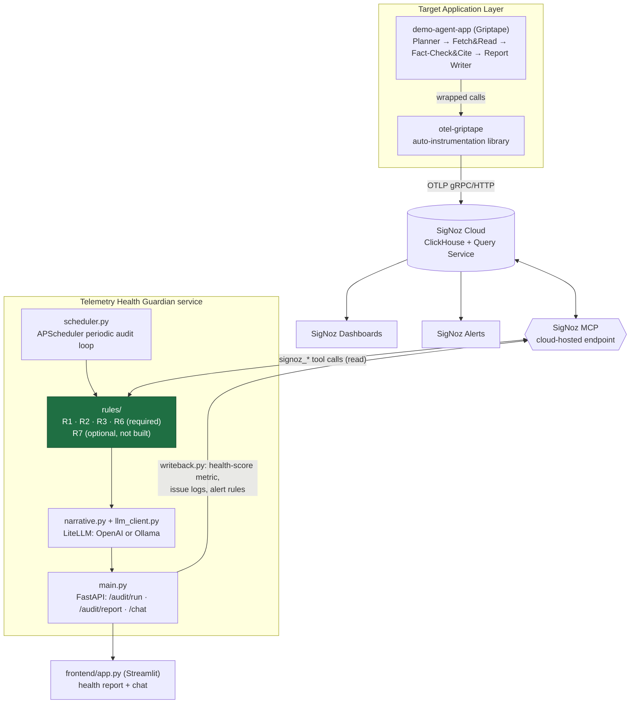

# Telemetry Health Guardian

**We don't observe the agent's behavior. We observe whether the observability
itself is trustworthy — then fix the instrumentation that produces it.**

Telemetry Health Guardian is an auditor for telemetry hygiene. It does not
watch what an AI agent *does* — it watches whether the *telemetry describing
what the agent does* can be trusted.

It has two parts:

1. **[`otel-griptape`](otel-griptape/)** — an OpenTelemetry auto-instrumentation
   library for [Griptape](https://github.com/griptape-ai/griptape), a Python
   agent framework that, as of this build, has no maintained OTel
   instrumentation package. This library emits *correct* telemetry by
   construction: GenAI-semconv spans, correct context propagation across
   sync and thread-pool concurrency, and W3C `traceparent` forwarding.
2. **The Guardian service** (`guardian/`) — an MCP-powered agent that
   continuously queries [SigNoz](https://signoz.io) — never the target app
   directly — to detect telemetry defects elsewhere: missing fields,
   cardinality explosions, broken trace trees, and hidden truncation. It
   scores telemetry health per service, explains findings in plain language,
   and writes results back into SigNoz as metrics, logs, and alerts.

Both parts run against a concrete demo workload, `demo-agent-app/`: a
four-stage **document research pipeline** (Planner → Fetch & Read →
Fact-Check & Cite → Report Writer) chosen because its natural failure modes
line up one-to-one with what this system detects — most notably a 50-page
PDF where only the first few pages ever reach the LLM's context, producing a
confident, wrong summary with no error anywhere. That's R6's canonical case,
not a contrived one.

All Guardian↔SigNoz traffic goes through the **SigNoz MCP server** — never a
direct SigNoz API/SDK call that bypasses MCP.

---

## What it catches

| ID | Check | Status |
|---|---|---|
| **R1** | Missing/incorrect GenAI semantic-convention attributes on spans (e.g. an LLM-call span missing `gen_ai.usage.input_tokens`), plus span-naming conformance | ✅ built |
| **R2** | Cardinality risk — raw prompt/completion text or other unbounded values written as *indexed* span attributes | ✅ built |
| **R3** | Orphaned/broken span trees within a service — async/threaded tool calls losing parent trace context | ✅ built |
| **R6** | Silent context-window/tool-result truncation — a tool returns 50KB, the agent sees the first 700 bytes, and answers confidently with no error surfaced | ✅ built |
| **R7** | Cross-service trace breaks at agent-to-agent handoffs (`traceparent` not forwarded over HTTP) | ⏸️ optional/stretch — not built in this submission (Stage 7 gate scope; see [Section 6](telemetry-health-guardian-BUILD-SPEC.md#6-build-order--follow-exactly-one-stage-at-a-time)) |
| R5 | Raw-content/PII leakage heuristic | ❌ out of scope by design — not implemented, stubbed, or scaffolded |

**Required MVP = R1 + R2 + R3 + R6**, and that MVP is what this submission
ships end-to-end, LLM-narrated and written back into live SigNoz dashboards
and alerts.

---

## Architecture



**Data flow:** target app emits spans → `otel-griptape` shapes them correctly
→ SigNoz Cloud ingests them → Guardian queries SigNoz *only* via the hosted
MCP endpoint → rule engine (R1/R2/R3/R6) + LLM produce a health report →
Guardian writes the report back into SigNoz as metrics/logs/alerts → SigNoz
dashboards and a thin chat UI surface it to a human.

The dashed/grey box in the diagram (R7) marks the one optional component
this submission does not build — see [Portability](#portability) and
[What's not built](#whats-not-built--and-why) below for why that's a
scope boundary, not an oversight.

### Health score (per service, 0–100)

```
health_score = 100
  - (missing_field_rate_pct * 0.30)   # R1
  - (cardinality_risk_score * 0.25)   # R2, normalized 0-100
  - (orphaned_span_rate_pct * 0.20)   # R3
  - (truncation_rate_pct   * 0.20)    # R6
```
(R7's 0.05 term is added automatically by `guardian/health_score.py` only
when an R7 result is supplied — it is never a hardcoded zero placeholder,
and this submission never supplies one.)

---

## Repository layout

```
telemetry-health-guardian/
├── README.md                          # this file
├── telemetry-health-guardian-BUILD-SPEC.md   # the spec this was built against
├── requirements.txt
├── env.example
├── verify_mcp_connection.py           # Stage 0 gate check
│
├── otel-griptape/                     # auto-instrumentation library (standalone-installable)
│   ├── pyproject.toml
│   ├── otel_griptape/
│   │   ├── instrumentor.py            # wraps Agent.run / Task dispatch / PromptDriver.run
│   │   ├── semconv.py                 # gen_ai.* attribute constants
│   │   ├── context_propagation.py     # sync/async parent-span handling, traceparent forwarding
│   │   └── payload_tracking.py        # byte-size tracking for R6
│   └── tests/
│
├── demo-agent-app/                    # document research pipeline — Section 4.1
│   ├── app.py                         # orchestrates the 4 stages
│   ├── planner.py / fetch_and_read.py / fact_check_and_cite.py / report_writer.py
│   ├── chaos.py                       # seeded fault injection: R1/R2/R3/R6 triggers
│   └── fixtures/                      # sample long PDF for R6 testing
│
├── guardian/
│   ├── main.py                        # FastAPI app
│   ├── scheduler.py                   # APScheduler audit loop + AuditStore
│   ├── mcp_client.py                  # SigNoz MCP session wrapper
│   ├── rules/                         # r1_missing_fields.py, r2_cardinality.py,
│   │                                  # r3_orphaned_spans.py, r6_silent_truncation.py
│   ├── llm_client.py                  # LiteLLM OpenAI/Ollama abstraction
│   ├── narrative.py                   # combines rule results into cited natural-language reports
│   ├── health_score.py
│   ├── writeback.py                   # writes metrics/logs back to SigNoz + creates MCP alerts
│   ├── scripts/provision_dashboards.py
│   └── tests/
│
├── frontend/
│   └── app.py                         # Streamlit: health report tab + chat tab
│
├── experiments/                       # per-stage verification drivers + build notes
│   ├── stage_wise_guidance.txt        # how each stage was verified, gate results
│   └── test_stage3.py … test_stage7.py
│
└── docs/
    └── WRITEUP.md                     # what this is, what it proves, known limitations
```

Two small, deliberate deviations from the spec's canonical layout in
Section 5: `verify_mcp_connection.py` lives at the repo root rather than
under `scripts/`, and `provision_dashboards.py` lives under
`guardian/scripts/` rather than a top-level `scripts/`. Both were correct
and working by the time this was noticed at Stage 8; moving them now would
touch every stage's verification-script instructions in
`experiments/stage_wise_guidance.txt` for a purely cosmetic gain, so they're
left as-is and documented here instead of silently "fixed."

There is no `r5_*.py` file anywhere in this repository, and no
`rules/r7_cross_service_breaks.py` — R7 was not started (see below).

---

## Running it

```bash
cp env.example .env   # fill in SigNoz Cloud MCP creds + at least one LLM provider

pip install -r requirements.txt
pip install -e otel-griptape
pip install -e guardian[test]

# one-time: provision dashboards + (optionally) alerts
python guardian/scripts/provision_dashboards.py

# generate a baseline trace
cd demo-agent-app
python app.py --question "What does the Kestrel Basin report say about sea level rise and drought?" --pdf fixtures/long_climate_report.pdf
cd ..

# start the backend
uvicorn guardian.main:app --reload --port 8000

# (optional) start the frontend
streamlit run frontend/app.py
```

Full per-stage build/verify instructions — including how to trigger each
chaos case — are in `experiments/stage_wise_guidance.txt`. The end-to-end
demo script is [Section 8 of the build spec](telemetry-health-guardian-BUILD-SPEC.md#8-end-to-end-verification-flow),
and the rehearsed walkthrough of that flow for this submission is in
[`docs/WRITEUP.md`](docs/WRITEUP.md).

---

## Portability

This system is **partially** framework-agnostic, not fully:

- **Genuinely agent-framework-agnostic:** R1, R2, and R3 all query SigNoz's
  stored telemetry generically — span attribute presence, cardinality
  stats, trace-tree structure. None of them inspect what produced the
  telemetry. Point the Guardian's rule engine at *any* service emitting
  standard OTel `gen_ai.*` spans (LangChain, CrewAI, raw OTel, anything) and
  these rules work immediately, no Guardian code changes.
- **Not agent-framework-agnostic:** `otel-griptape` is Griptape-specific by
  construction — it wraps Griptape's own `Agent.run()` / `Structure.run()` /
  `PromptDriver.run()`. That's intentional: its value is specifically that
  it fills a real gap for a framework with no existing OTel support.
- **R6** depends on two custom span attributes (`payload.raw_bytes`,
  `payload.captured_bytes`) that only `otel-griptape` sets. Point the
  Guardian at an app that doesn't set them and R6 doesn't error — it simply
  never fires, because there's nothing for it to compare.

This is **not** "plug and play for any AI agent," and this README doesn't
claim that. See Section 9 of the build spec for the full boundary.

---

## What's not built — and why

- **R7** (cross-service handoff breaks) is explicitly optional stretch scope,
  gated behind the Stage 7 verification flow passing *and* an explicit
  instruction to continue (Section 6, Stage 7). This submission ships the
  required R1+R2+R3+R6 MVP fully wired end-to-end — rule engine → LLM
  narrative → SigNoz writeback → dashboards → alerts → chat — and stopped
  there rather than starting `citation_service.py` /
  `r7_cross_service_breaks.py` without that go-ahead.
- **R5** (raw-content/PII leakage) is out of scope by explicit design
  decision in the spec, not an oversight — no stub, no placeholder.

## License / attribution

Built against `telemetry-health-guardian-BUILD-SPEC.md` (included in this
repo) as a submission demonstrating auto-instrumentation for an
unsupported agent framework (`otel-griptape`) alongside an MCP-driven
telemetry-quality auditor (Guardian) that treats observability data itself,
not just agent behavior, as something worth verifying.
